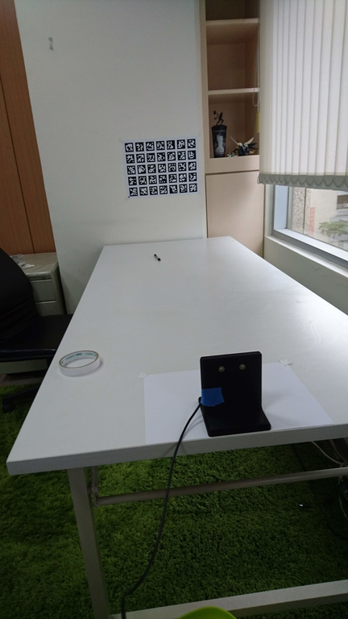
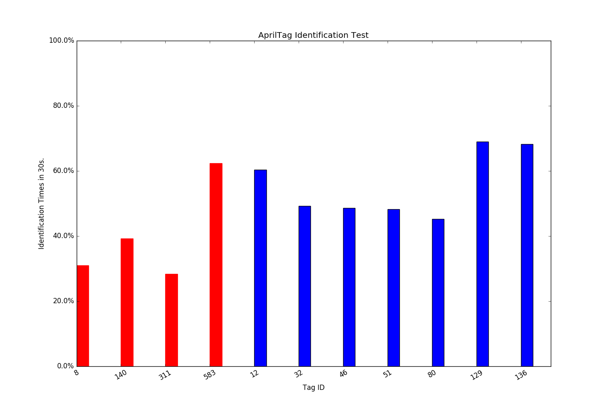

Tags_Validation
===

We want to implement the [apriltag_ros](http://wiki.ros.org/apriltags_ros) for accurate localization on moving robot.

Since there are hundreds of tag to choose, this package is a small tool for recognition rate comparision.

## Assumption:

There are some tags can be easily detected even under jello effect or image distortion cause by moving.

## Test Procedure:



1. Set up the tags set and your camera. My setting is the picture above. In my scenario, the camera need to identify in 1.6 m distance away in moving.
2. Launch the camera_proc_tag.launch. It will bring up the usb_cam, image_proc, and apriltag_detector_node.
3. Moving the camera horizontally slowly and steady (~0.1m/s). Record the topics.
```
rosbag record /usb_cam/tag_detections /usb_cam/tag_detections_image/compressed /usb_cam/image_rect_color/compressed -o 46.bag
```
4. Playback the data and run the "tag_recognition_counter.py" And it will  monitor the recognition rate out of 500 image frame.


## Aptiltags
* 36h11